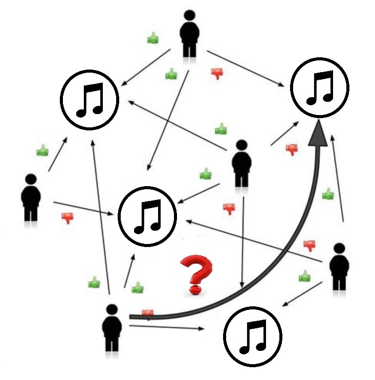
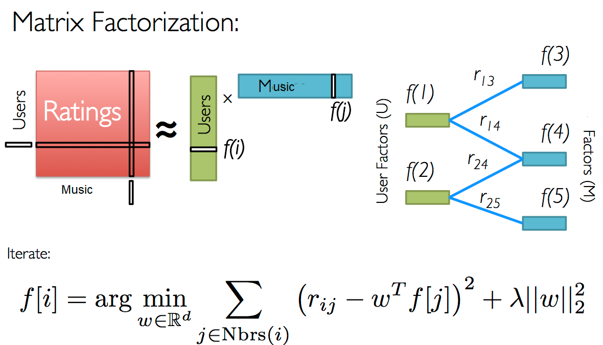
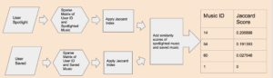
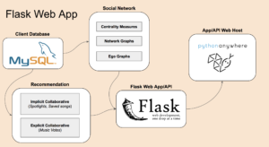
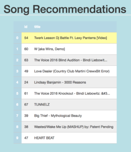

# RecommendationSystem 
#### Bootcamp capstone project

A Recommendation system is a subclass of INformation Filtering Systems which seek to predict a user's preference to an item. For my client, I attempted ti lay the foundation for improving user experience by suggesting music based on user ratings, user spotlights of music and music saves.

## Collaborative filtering
Collaborative filtering works on the priciple of collective intelligence - combining behavior, preferencs, or ideas of a group of people to derive insights. The assumption is that users who have similar preferences in the past are likely to have similar preferences in the future.

### Using Explicit Feedback
Explicit inout from the user regarding an item - prompting the user for rating. The accuracy of such a recommendation system depends on tge quantity of ratings provided by the user. It is seens as reliable data, provides transparency into the recommendation process. I used Matrix Factorization (Singular Value Decomposition).

#### Matrix Factorization

### Using Implicit Feedback
The system will infer user's preferences by monitoring different user actions like links followed by a user, button clicks amongst others. The predictions are objective, as there is no bias. I identified music 'saved' and 'spotlighted' as our implicit features for the client. For deriving similarities I used Jaccard Distance. The formula compares abd produces a simple decimal statistic between 0 and 1.

#### Jaccard Index

## Hybrid Collaborative System
I implemented Weighted Hybrid Collaborative system to make recommendations. In this ratings of explicit and implicit recommendation techniques are combined together to produce a single recommendation.

## Flask App - RESTful API

## Improvements
* Once enough categorical data has been collected (ex: favorite genre, geographic location, birthday etc.), users can be filtered by category in accordance to some factors like song rating. 
* Artist followed data data can be treated as implicit data collection and used ti add weightage to recommendations. 

